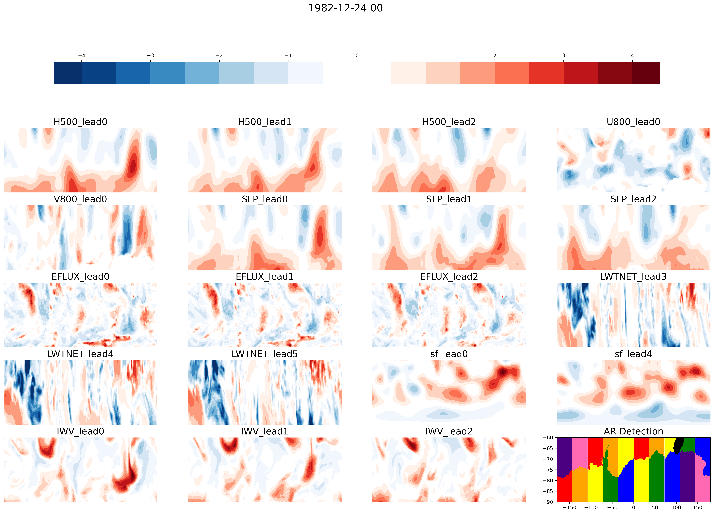

# Instructions for Making X data

### 1. Create yrly files of X variables
#### Make_yrly_data.py, Make_yrly_data.script

* Run in parallel over year 1980 - 2019
* Variables include:'

|| Variable | Level | Lats Included | Lead Times (days) |
|:---:| :---:     |  :---:|  :---:        | :---: |
|1|H| 500hPa |    -75, -40 |0|
|2||  |     |1|
|3|| |   |2|
|4| U wind | 800hPa |    -75, -45 |0|
|5| V wind | 800hPa |    -75, -45 |0|
|6| SLP|  |    -75, -40 |0|
|7| |  | |1|
|8| |  | |2|
|9 |Upwards Latent Energy Flux|  |    -75, -20 |0|
|10|Upwards Latent Energy Flux|  |    -75, -20 |1|
|11|Upwards Latent Energy Flux|  |    -75, -20 |2|
|12 |Tropical Convection|  |   -20, 0 |4|
|13|Tropical Convection|  |    -20, 0 |6|
|14|Tropical Convection|  |   -20, 0 |8|
|12 | 4 day averaged Stream Function| |   -90, 0 |0 to 3 |
|13 | | | |4 to 8 |
|14|IWV|  |    -75, -40 |0|
|15|IWV|  |    -75, -40 |1|
|16|IWV|  |    -75, -40 |2|
|17| Aerosol Optical Depth| |    -75, -40 |0|
|18| | | |1|
|18| | | |2|

|4|IWV|  |    -70, -40 ||
|2 |Upwards Latent Energy Flux|  |    -50, -20 ||
|3 |Tropical Convection| |  -20, 0 | 4 days|
|4 |Stream Function| |   -90, 0 |2 days |
|5| SLP|  |    -75, -45 ||
|6| U wind | 800hPa |    -75, -45 ||
|7| V wind | 800hPa |    -75, -45 ||
|8| U wind | 950hPa |    -75, -45 ||
|9| V wind | 950hPa |    -75, -45 ||

* Select the year, level, and variable using cdo commands. These are saved to scratch directories because memory did not allow loading these to work with
* Call function Resample
    * Resample to daily mean (this may smooth some anomalous values but we will calculate the standardized anomalies based on these values so we should capture anomalies)
    * If you want a leadtime x, shift data forward by that amount, leaving nan values for the first x hours 
    * Interpolate data using the Lats Included and -180 to 180 longitude for each variable. (lon: 576, lat: 181) ->  (lon: 144, lat: 90). This maintains a minimum gridcell area at the equator of 210x111km implying a synoptically-resolved minimum resolution of 840x444km. 
* Save as yearly data

### 2. Make Standardized Anomalies
#### Make_std_anomalies.py, Make_std_anomalies.script

* Run in parallel over list of 9 variables
* Add a uniform lat_index from 0 to 89 to make combining X data easy,
    leave the true lats for each variable as a coordinate
* Calculate monthly mean and standard deviation of all other variables
    * IWV is not normaly distributed because it starts at zero and has a long right tail.
        Calculate standard deviation by assuming a normal distribution of the right half 
        and a mirror image of the right half. 
* Based on the monthly mean and standard deviation, calculate the monthly standardized anomalies
* Save to a new directory 

### 2. Plot X variable data
#### Plot_X_data.ipynb
* plot individual timesteps of X data to check it out
