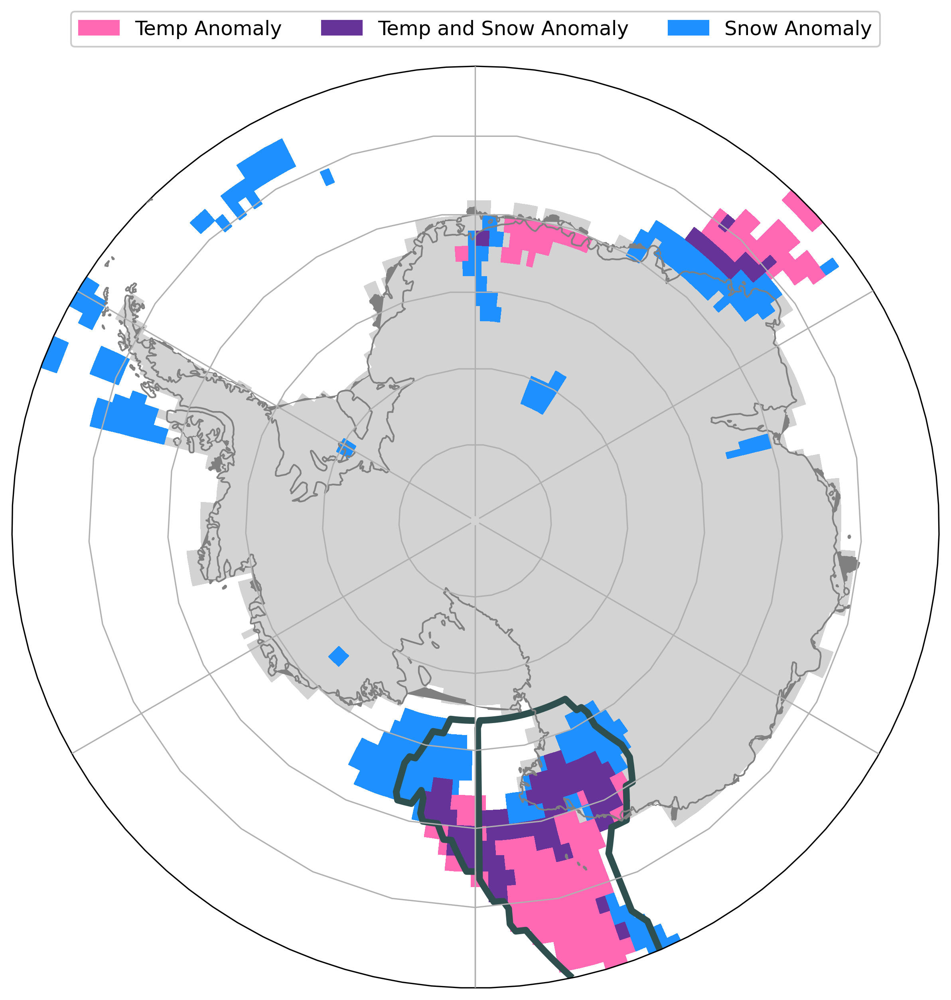

# Instructions for Making Y data

### 1. Calculate top percentiles of T2M and PRECSN
#### Make_Y_data_1.py, Make_Y_data_1.script
* Calculated for latitudes -90 to -60 from 1980 through 2019
* Calculated monthly quantiles in parallel because of memory limitations
* Monthly quantiles for both T2M and PRECSN are saved in a scratch directory
* Note: Make_Y_data_1.script sets mem=150G, job crashed at lower values

### 2. Calculate Yearly Anomaly data for T2M and PRECSN
#### Make_Y_data_2.py, Make_Y_data_2.script
* For T2M and PRECSN load in monthly percentiles calculated in step 1 and hourly raw data for each year
* Label each hourly value 1 if it is above 98th percentile, 0 if it is below
* Resample to 6hourly data, take maximum value. This ensures that every 6hourly chunk that contains an hour of variable above 98th percentile is flagged
* Only save the timesteps that contain some lat/lon aboe the 98th percentile
* Add a dimension "lat_index" that will be uniform for all X and Y data, regardless of which 30 degree lat chunk we use
* Label all PRECSN 98th percentile values as 10, all T2M 98th percentile values as 1. This will be used in Make_y_3.py to make a final four digit value for Y.
* Note: this creates yearly files showing monthly anomalies for T2M and PRECSN

### 3. Calculate Yearly Y data including AR flag, T2M anomalies, PRECSN anomalies, and Land mask
#### Make_Y_data_3.py, Make_Y_data_3.script
* Load in AR mask data for year for lat slice -90 to -60
* Take the 6hourly maximum to insure any 6hour chunk with an AR is flagged
* Coarsen to a grid resolution of 256 lons and 32 lats
* Any grid point that is associated with an AR is marked with an AR flag, assign 100
* Load PRECSN and T2M datasets from step 2
* Create land and ice shelf mask with values of 1000 and 0 over ocean
* Create new xarray with time, lat_index 0 through 32, and lon index -180 through 180
* Assign value to each timestep at each grid cell with any combination of:

 * 1000: Ice sheet or shelf
 * 100: AR
 * 10: Anomalous PRECSN
 * 1: Anoalous T2M

### 4. Plot Y variable data
#### Plot_Y_data.ipynb
* plot individual timesteps of Y data to check it out

### 5. Make Y data that only labels AR
#### Make_Y_data_4.py, Make_Y_data_4.script

* Based on testing, we need some changes to Make_Y_data_3 output. We save the original data becuase it could be useful in analysis
* Open the data created in Maky_Y_data_3.py, only label landfalling ARs 1, everything else 0.
* Randomely select an equal number of timesteps with and without ARs.
* Randomely split timesteps into training (70%), testing (15%), and validating (15%)
* Run in a batch script becuase of memory limitations